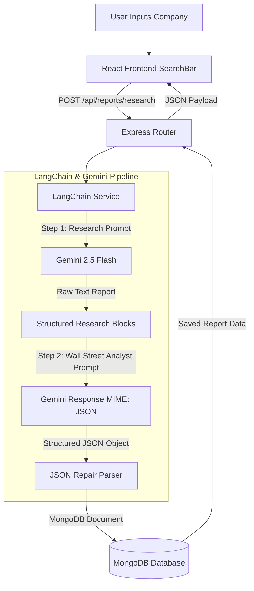

# 🤖 ai Agent - Deep Equity Research & Analysis System

An advanced financial intelligence platform that performs deep equity research, financial analysis, and investment recommendations. It leverages Gemini models, LangChain, Node.js/Express, MongoDB, and a fully reactive React + Vite frontend styled with Tailwind CSS v4.0 and TypeScript.

---

## 📌 Table of Contents
1. [Overview — What It Does](#-overview--what-it-does)
2. [How It Works — Approach & Architecture](#-how-it-works--approach--architecture)
3. [Key Decisions & Trade-offs](#-key-decisions--trade-offs)
4. [Example Runs](#-example-runs)
5. [How to Run It — Setup & Env Configuration](#-how-to-run-it--setup--env-configuration)
6. [Project Folder Structure](#-project-folder-structure)

---

## 🔍 Overview — What It Does

**ai Agent** is an automated stock analysis and financial intelligence platform.
* **Intelligent Stock Analysis**: Users input a company name (e.g., "Microsoft" or "Tesla"), and the AI Agent automatically initiates a comprehensive research task.
* **Deep Financial Research**: The backend agent retrieves company overview data, compiles recent earnings calls/news from the last 6-12 months, evaluates balance sheets & profitability margins, and determines Wall Street analyst sentiment.
* **Investment Scorecard**: Automatically evaluates risks, outlines growth pros and competitive moats vs. operational cons, and generates an **Investment Score (0-100)** with a binary recommendation (**Invest** or **Pass**).
* **Interactive Dashboard**: Features a high-fidelity glassmorphic sidebar listing search history and loaded reports, a search input bar with animated gooey transitions, and detailed visual data widgets (score meters, bulleted pros/cons lists, analysis paragraphs, and raw research transcripts).

---

## 🧠 How It Works — Approach & Architecture

The system utilizes a split-chain workflow orchestrated through **LangChain** and **Gemini** to separate factual information gathering from synthesis/valuation:



### 1. Two-Step Pipeline Execution
1. **Research Phase**: Initialize a `ChatPromptTemplate` targeting the target company. The Gemini model (`gemini-2.5-flash`) acts as a financial research assistant, gathering data into five target sectors:
   * Company Overview
   * Latest News (past 6-12 months)
   * Financial Performance Indicators
   * Market Sentiment Consensus
   * Strengths & Risks
2. **Analysis Phase**: Feed the compiled research into a secondary Wall Street Investment Analyst template. Enforce a structured JSON schema configuration output using Gemini's native `responseMimeType: "application/json"`.

### 2. Output Extraction & Repair Parser
* LLMs occasionally fail JSON parsing due to unescaped quotes or newlines within text values.
* An active **JSON repair helper** cleans formatting characters and programmatically escapes illegal control characters before parsing, preventing runtime exceptions.
* Parsed records are stored in MongoDB via Mongoose using the `Report` schema.

---

## ⚖️ Key Decisions & Trade-offs

### What We Chose and Why:
* **Gemini 2.5 Flash Model**: Selected for its fast inference speeds, low latency, and native support for structured JSON MIME type formatting. 
* **LangChain Chains**: Utilized `RunnableSequence` constructs to establish modular, sequential chains. This makes adding pre-processors, vector embeddings, or search tools in the future straightforward.
* **MongoDB**: A document store model matches the unstructured layout of raw research and dynamic arrays (pros/cons) without complex relational table schemas.
* **Tailwind CSS v4.0 + TypeScript**: Migrated the legacy client app to TypeScript to provide static type checks for API responses. Upgraded to Tailwind v4.0 to leverage modern theme config variables directly in the global stylesheet without double-file configurations.
* **Inline Deletion UI**: Swapped standard browser-blocking `confirm()` prompts for in-UI toggle checks. This bypasses security rules in sandboxed developer shells (like embedded webviews) where browser dialogs are blocked.

### What Was Left Out / Future Enhancements:
* **Live Search API Integrations**: Currently, the agent relies on the LLM's training cutoff and general research knowledge. Integrating web searching (like Google Search API) was left out of the MVP to avoid API rate limits, but can easily be added as a LangChain Tool.
* **User Authentication**: Left out to keep access frictionless and direct. The sidebar displays global MongoDB research history.
* **PDF Report Exports**: Deferred in favor of browser print optimizations (using tailwind `print:hidden` to format reports for clean paper/PDF prints).

---

## 📊 Example Runs

### Example 1: Microsoft Corporation (Invest Recommendation)
* **Investment Score**: `92`
* **Risk Level**: `Low`
* **Pros**: 
  * dominant cloud service provider (Azure growth)
  * robust enterprise SaaS ecosystem (Office 365, Copilot integrations)
  * stellar balance sheet with significant cash reserves
* **Cons**: 
  * high valuation multiples
  * regulatory scrutiny regarding AI acquisitions and search market share
* **Reasoning Summary**: Microsoft represents a highly resilient investment opportunity. Their enterprise software dominance acts as a core cash engine, which is successfully funding their aggressive AI infrastructure buildouts. While valuation margins are high, their strategic moat remains wide.

---

### Example 2: Tesla, Inc. (Pass Recommendation)
* **Investment Score**: `60`
* **Risk Level**: `High`
* **Pros**:
  * industry-leading EV manufacturing capabilities and scale
  * software monetization potential via FSD (Full Self-Driving)
* **Cons**:
  * cyclical pressure and slowing global EV demand
  * intense pricing competition from domestic Chinese manufacturers (BYD)
  * high key-person risk
* **Reasoning Summary**: Tesla is rated a Pass at current valuations due to heightened short-to-medium-term operational risks. Margin compression from automotive price cuts, combined with volatile production targets, offsets high automation expectations. A lower score reflects cyclical tailwinds turning into headwinds.

---

## ⚙️ How to Run It — Setup & Env Configuration

### Prerequisites
* **Node.js** (v18 or higher)
* **MongoDB** (local database server or MongoDB Atlas URI)
* **Gemini API Key** (acquired from Google AI Studio)

---

### 1. Configuration (.env setup)
Create a `.env` file inside the `backend/` directory:

```env
PORT=5000
MONGODB_URI=mongodb://127.0.0.1:27017/ai-agent-research
GEMINI_API_KEY=your_gemini_api_key_here
GEMINI_MODEL=gemini-2.5-flash
```

---

### 2. Startup Steps

#### Start Backend Service
```bash
cd backend
npm install
npm run dev
```
*The API server launches on `http://localhost:5000`*

#### Start Frontend Client
```bash
cd frontend
npm install
npm run dev
```
*The Vite hot-reload server launches on `http://localhost:5173`*

#### Compiling Production Bundles
```bash
cd frontend
npm run build
```
*Outputs minified production-ready scripts in `frontend/dist/`*

---

## 📂 Project Folder Structure

```
AI Product/
├── backend/              # Node.js + Express API server
│   ├── src/
│   │   ├── config/       # MongoDB Connection Loader
│   │   ├── models/       # Mongoose Schemas (Report.js)
│   │   ├── routes/       # Express Route endpoints (reports.js)
│   │   ├── services/     # LangChain orchestrations & repair logic (langchain.js)
│   │   └── server.js     # Express starter entry
│   └── package.json
├── frontend/             # React Client Application
│   ├── src/
│   │   ├── assets/       # Branding assets (logo images, icons)
│   │   ├── components/   # UI Layout files (SearchBar, HistorySidebar, ReportDisplay)
│   │   │   └── ui/       # Atom components (gooey-input.tsx)
│   │   ├── lib/          # Utilities (utils.ts class merger)
│   │   ├── App.tsx       # Core dashboard state & fetching
│   │   ├── main.tsx      # React root boostrapper
│   │   └── index.css     # Global styles & Tailwind v4.0 theme variables
│   ├── index.html        # Main HTML wrapper & favicon
│   ├── tsconfig.json     # TS config
│   └── vite.config.js    # Vite compilation rules
└── README.md             # Project-wide documentation
```
